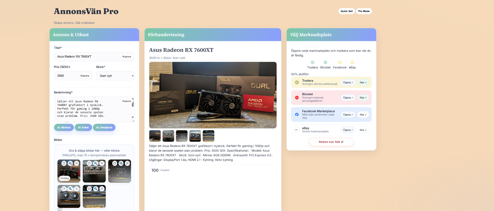
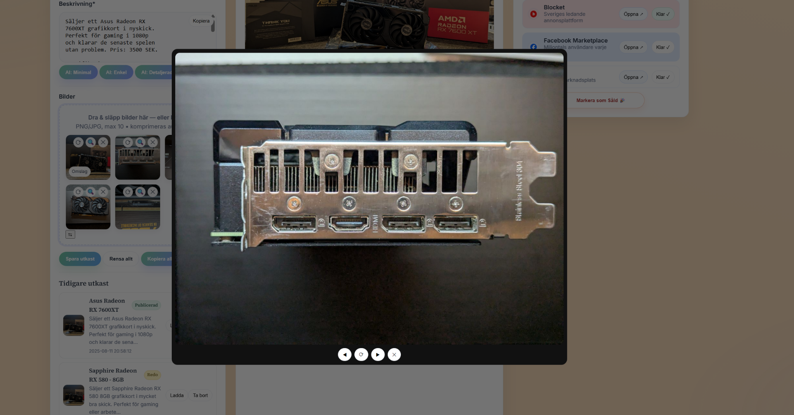
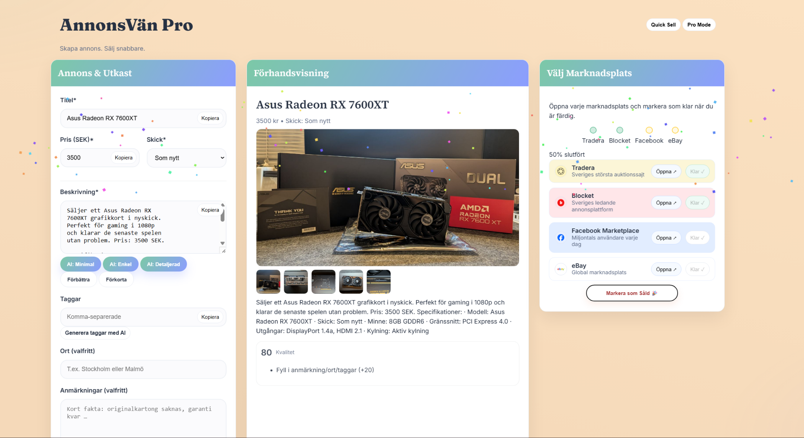

# 📦 AnnonsVän Pro

**Create once. Publish everywhere.**  
A lightweight, browser-based studio for crafting listings and publishing them to multiple marketplaces — fast.

  <a href="https://annonsvn.vercel.app/"><b>🚀 Open the App</b></a>

  <a href="https://annonsvn.vercel.app/">Live</a> •
  <a href="#-features">Features</a> •
  <a href="#%EF%B8%8F-core-features">Core Features</a> •
  <a href="#-quickstart">Quickstart</a> •
  <a href="#-screenshots">Screenshots</a> •
  <a href="#-tech">Tech</a> •
  <a href="#-roadmap-v2">Roadmap</a> •
  <a href="#-faq">FAQ</a>

---

## 💡 What is AnnonsVän Pro?
AnnonsVän Pro is your control room for listings. **One ad → multiple marketplaces, no repetition.**  
Write the listing once, let AI draft the Swedish description, drop in images (compressed locally), and **one-click open** each marketplace with formatted content ready to paste. A subtle quality score nudges you to “ready” without getting in the way.

---

## ✨ Features
- **Unified listing form** – Title, price, condition, tags, notes; with a live preview.
- **Image flow that feels good** – Drag & drop, cover image, reorder with smooth visual feedback, rotate, fullscreen lightbox.
- **AI description (Swedish)** – Minimal / Simple / Detailed styles via Gemini API (with graceful local fallback).
- **Preview** — large hero + strip, mirrors order live.  
- **Marketplace helpers** – Tradera, Blocket, Facebook Marketplace, eBay; copy-ready text per platform + progress tracker.
- **Drafts** — stored in the browser (`localStorage`), with cover image, status badge, snippet, timestamp.  
- **Quality score** – Clear, actionable hints to reach a strong listing.
- **No accounts, no setup** – It’s just the web. Open and go.

---

## ⚡ Quickstart / How it works
1. Open **[annonsvn.vercel.app](https://annonsvn.vercel.app/)**.  
2. Enter **title, price, condition** → drag in your images.  
3. Click an **AI style** to draft the Swedish description.  
4. **Preview** updates live; mark marketplaces **Klar** as you finish.  
5. (Optional) **Save draft** — continue later in the same browser.

> Tip: The first image in the gallery is the **cover**. Click **Omslag** on any image to promote it to hero.

---

## 🖼 Screenshots

<table>
  <tr>
    <td colspan="2" align="center">
      
    </td>
  </tr>
  <tr>
    <td width="50%" align="center">
      
    </td>
    <td width="25%" align="center">
      
    </td>
  </tr>
</table>

<i>Studio overview (top) · Lightbox & checklist (bottom)</i>

---

## 🧰 Tech
**Front-end**  
- **HTML5** (semantic structure)  
- **CSS3** (custom properties, responsive grid, animated gradient background)  
- **Vanilla JavaScript (ES2020+)** for state, drag/reorder, lightbox, scoring

**AI**  
- Google **Gemini API** (via lightweight server proxy) for Swedish description generation  
- Clean **template fallback** when API is unavailable

**Images**  
- Client-side **resize/compression** via Canvas API  
- Local **rotate**, fullscreen **zoom & rotate**

**State & Storage**  
- **localStorage** for drafts, marketplace progress, and preferences

**Hosting**  
- **Vercel** (global edge, HTTPS by default)

---

## 🗺 Roadmap (v2)
**Top priorities**
- 🧩 **Move to SvelteKit + Tailwind CSS** for performance, component structure, and consistent design system.  
- 🧭 **Browser extension** to auto-fill marketplace forms (Tradera, Blocket, FBM, eBay) directly on their sites.  
- 📱 **Mobile optimization** (thumb-first interactions, bigger targets, faster image handling on phones).

**Also planned**
- 🔌 Direct publishing via official marketplace APIs (where policies allow).  
- ☁️ Cloud sync for drafts (multi-device continuity).  
- 🖼 Platform-aware image optimization (size/ratio/background).  
- 🌍 More marketplaces & smarter templates.  
- 👥 Optional account layer (teams/history) when needed.

---

## ❓ FAQ

<b>Does it publish to marketplaces automatically?</b>

Not yet. Today it prepares perfectly formatted content and opens each marketplace so you can paste/confirm. API/extension-based publishing is on the roadmap where platform policies allow it.

<b>Where do my images and drafts live?</b>

Locally in your browser via <code>localStorage</code>. Images are compressed client-side; nothing is uploaded unless you publish on a marketplace.

<b>Is AI required?</b>

No. AI is optional. If the Gemini API isn’t reachable, the app falls back to a clean, local template.

<b>Will it work well on mobile?</b>

Yes — panels stack vertically and controls scale. A dedicated mobile pass is a top priority in v2 for a truly thumb-first feel.

---

## 👤 About
Built and maintained by **a one-person team**.  
If you enjoy AnnonsVän Pro, a ⭐ on the repo means a lot.

**Contact:** open an issue or just send a message.

---

## 📄 License
non yet (dont steal it)
