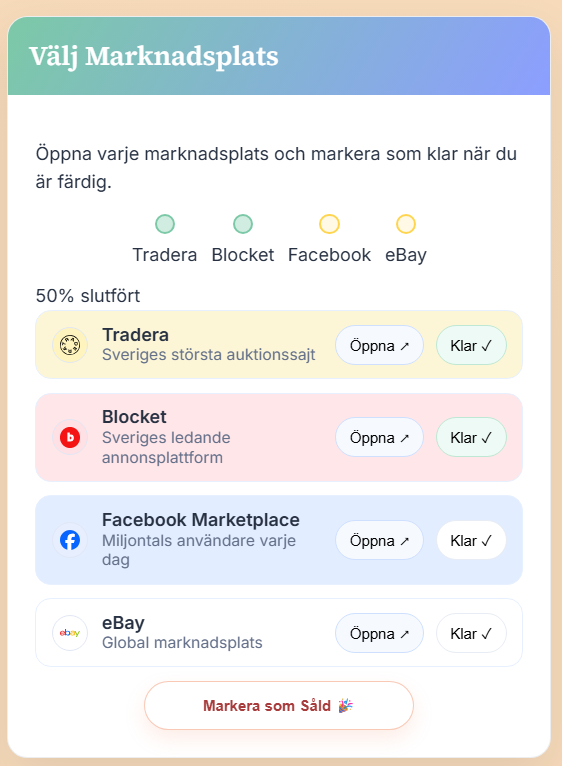

# 📦 AnnonsVän Pro

**Create once. Publish everywhere.**  
A lightweight, browser‑based studio for crafting listings and publishing them to multiple marketplaces — fast.

  <a href="https://annonsvn.vercel.app/"><b>🚀 Open the App</b></a>

  <a href="https://annonsvn.vercel.app/">Live</a> •
  <a href="#-features">Features</a> •
  <a href="#-quickstart">Quickstart</a> •
  <a href="#-screenshots">Screenshots</a> •
  <a href="#-tech">Tech</a> •
  <a href="#-roadmap">Roadmap</a> •
  <a href="#-faq">FAQ</a>

---

## 💡 What is AnnonsVän Pro?
AnnonsVän Pro is your control room for listings. **One ad → multiple marketplaces, without repeating yourself.** You write the listing once, AI drafts the description in Swedish, you drop in images (we compress locally), and then you **one‑click open** each marketplace with formatted content ready to paste. A subtle quality score nudges you to “ready” without getting in the way.

---

## ✨ Features
- **Unified listing form** – Title, price, condition, tags, notes; with a live preview.
- **Image flow that feels good** – Drag & drop, cover image, reorder with visual feedback, rotate, fullscreen lightbox.
- **AI description (Swedish)** – Minimal / Simple / Detailed styles via Gemini API (with graceful local fallback).
- **Marketplace helpers** – Tradera, Blocket, Facebook Marketplace, eBay; copy‑ready text per platform + progress tracker.
- **Drafts that survive refreshes** – Local autosave for listings, images, and per‑platform completion.
- **Quality score** – Clear, constructive hints to reach a strong listing.
- **No accounts, no setup** – It’s just the web. Open and go.

---

## ⚡ Quickstart
1. Open **[annonsvn.vercel.app](https://annonsvn.vercel.app/)**.  
2. Enter **title, price, condition** → drag in a few images.  
3. Click an **AI style** to draft the Swedish description.  
4. **Preview** updates as you type; mark marketplaces **Klar** as you finish.  
5. (Optional) **Save draft** — pick up later on the same device.

> Tip: The first image in the gallery is used as the **cover**. Click “Omslag” on any image to promote it to hero.

---

## 🖼 Screenshots

<table>
  <tr>
    <td width="33%"></td>
    <td width="33%"></td>
    <td width="33%"></td>
  </tr>
</table>

<i>Studio, image tools, and marketplace checklist.</i>

---

## 🧰 Tech
**Front‑end**  
- HTML5  
- CSS3 (custom properties, responsive grid, animated gradient background)  
- Vanilla JavaScript (ES2020+)

**AI**  
- Google **Gemini API** (server proxy) for Swedish description generation  
- Template‑based fallback when the API is unavailable

**Images**  
- Client‑side resize/compression via Canvas API  
- Local rotations; fullscreen zoom & rotate

**State & Storage**  
- `localStorage` for drafts, progress, and preferences

**Hosting**  
- **Vercel** (global edge network, HTTPS by default)

---

## 🗺 Roadmap (v2)
- Direct publishing via official marketplace APIs (where available)
- Cloud sync for drafts (multi‑device)
- Image auto‑optimization per platform (size/ratio/background)
- More marketplaces & smart templates
- Optional account layer for teams & history

---

## ❓ FAQ

<b>Does it publish to marketplaces automatically?</b>

Not yet. Today it prepares perfectly formatted content and opens each marketplace so you can paste/confirm. API publishing is on the roadmap where platform policies allow it.

<b>Where do my images and drafts live?</b>

Locally in your browser (localStorage). Images are compressed client‑side; nothing is uploaded unless you choose to publish on a marketplace.

<b>Is AI required?</b>

No. AI is optional. If the Gemini API isn’t reachable, we fall back to a clean, local template.

<b>Can I use this on mobile?</b>

Yes. The layout adapts for smaller screens (panels stack vertically). Desktop offers the most room for image work.

---

## 👤 About
Built and maintained by **a one‑person team**.  
If you enjoy AnnonsVän Pro, a ⭐ on the repo helps a lot.

**Contact:** Open an issue or reach out via the app.

---

## 📄 License
Add your preferred license here (MIT recommended).

